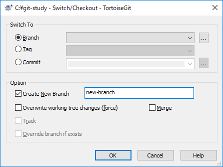

# git-study

## 1. ブランチを作ろう

Gitといえばブランチ！まずはブランチを作りましょう！

### コマンド派の人

```
# git checkout -b new-branch
```

`git checkout` コマンドはブランチを移動するコマンドです。  
それに -b オプションを付けることで、「ブランチを作ってその作ったブランチに移動する」というコマンドになります。

### GUI(TortoiseGit)派の人

Gitリポジトリのフォルダを右クリック > TortoiseGit > Switch/Checkout  
Optionの「Create New Branch」にチェックを入れてブランチ名を入力してOK  
これで、上のコマンドと同じことをGUIで行うことができます。



### 2. 新しく作ったブランチで作業をしよう

ブランチを作ったらそこでやりたい作業を行います。  
ここでの作業はmasterブランチ（先ほどのブランチ）には影響しません。  
今回はファイルを作ってコミットしましょう！

### コマンド派の人

```
# echo "Hello Git!" >> test.txt
# git add test.txt
# git commit -m "add test.txt"
```

"Hello Git!" と記載された test.txt を作成  
`git add test.txt` で test.txt をステージング（コミットに含めたい変更に test.txt を追加）  
`git commit -m "add test.txt"` で"add test.txt"というメッセージでコミット  

### GUI(TortoiseGit)派の人

test.txtを新規作成して "Hello Git!" と記述して上書き保存  
Gitリポジトリのフォルダを右クリック > "Git Commit > new-branch"  
Messagesに "add test.txt" と入力  
test.txt にチェックを入れてCommit  
これで、上のコマンドと同じことをGUIで行うことができます。


### 3. コミットしてもリモートにはまだ反映されていないことを確認しよう

GitはコミットしてもSVNのようにリモートには反映されません。  
GitHubのリポジトリページ > Branch のプルダウンから "new-branch" というブランチがまだ作成されていないことを確認しましょう！


### 4. リモートに変更を反映しよう

それでは、リモートに変更を反映しましょう！

### コマンド派の人

```
# git push origin new-branch
```

`git push origin new-branch` でリモート（GitHub）のnew-branchというブランチに変更を反映（この時にGitHub側にもnew-branchというブランチが作られます）

※ originとはデフォルトのリモートリポジトリの名前です。

```
# git remote -v
origin  https://github.com/k-nakayama-pg/git-study.git (fetch)
origin  https://github.com/k-nakayama-pg/git-study.git (push)
```

これで、リモートにnew-branchというブランチが作成され変更内容が反映されます。  
masterブランチにはtest.txtはありませんが、new-branchブランチにはtest.txtがあることが確認できます。


### GUI(TortoiseGit)派の人

Gitリポジトリのフォルダを右クリック > TortoiseGit > Push  
Local が new-branch になってることを確認してOK  
これで、上のコマンドと同じことをGUIで行うことができます。


### 5. masterブランチに戻ってみよう

new-branchブランチの作業は終わりました。本当にmasterブランチには影響が及んでいないのか確認しましょう！

### コマンド派の人

```
# git log --oneline
2467bb4 add test.txt
d5ac089 fix README
9fbaade add README
# ls
img/  README.md  test.txt
# git checkout master
# git log --oneline
d5ac089 fix README
9fbaade add README
# ls
img/  README.md
```

`git log --oneline` で3つのコミットログがあることを確認  
`ls` でtest.txtがあることを確認  
`git checkout master` でmasterブランチに移動  
`git log --oneline` で2つしかコミットログがないことを確認  
`ls` でtest.txtがないことを確認  

この確認により以下のことが分かりました！

- Gitのコミットログはブランチ毎に違うログを持つ（今までのコミットログは変わらず、新しくコミットしたところだけそのブランチにのみ追加されていく）
- ブランチを移動すれば、そのブランチの資産でリポジトリ内のフォルダが置き換わる

### GUI(TortoiseGit)派の人

Gitリポジトリのフォルダを右クリック > TortoiseGit > Show Log  
3つのコミットログがあることを確認  


フォルダを開きしtest.txtがあることを確認  
Gitリポジトリのフォルダを右クリック > TortoiseGit > Switch/Checkout  
Branchをmasterに変更してOK


Gitリポジトリのフォルダを右クリック > TortoiseGit > Show Log  
2つしかコミットログがないことを確認


フォルダを開きしtest.txtがないことを確認  

### まとめ

- ブランチを作ることで、そのブランチにしか影響しない作業ができる。
- コミットしてもリモートには反映されない。プッシュして初めてリモートに反映される
  - SVNのコミットとは違う。
- ブランチのコミットはそのブランチのみ有効。他のブランチにはコミットログは残らない。
- ブランチを移動するとフォルダがそのままそのブランチの内容で置き換わる。
  - 今回のようにtest.txtがあるブランチからないブランチに移動する場合、test.txtをエディターで開いているとwarningが出るので注意。